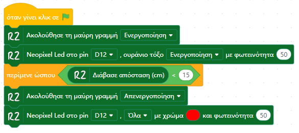
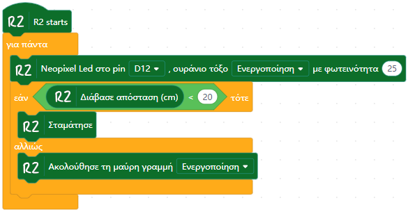

# 📘 Παραδείγματα Χρήσης block R2 (R2-Examples)

Σε αυτό το αρχείο θα βρείτε παραδείγματα χρήσης και λειτουργίας των blocks του πρόσθετου R2.

---

## 🌈 Ακολούθηση Γραμμής με Rainbow Effect (Line Patrol)

Παράδειγμα χρήσης του block **ακολούθηση γραμμής (line patrol)** σε συνδυασμό με το **rainbow effect** των NeoPixel LEDs.

📁 Kατεβάστε το έργο από [εδώ](https://raw.githubusercontent.com/vmihas/MindPlus-Custom-Build/main/examples/r2-linepatrol_with_rainbow.mp)

---

## 🚧 Ακολούθηση Γραμμής με στάση σε Εμπόδιο (Line Patrol + Ultrasonic + Rainbow)

Παράδειγμα σε **offline mode**, όπου το ρομπότ ακολουθεί τη μαύρη γραμμή ενώ τα NeoPixel LEDs τρέχουν συνεχώς το **rainbow effect** και σταματά όταν εντοπίσει εμπόδιο μπροστά του.

📁 Kατεβάστε το έργο από [εδώ](https://raw.githubusercontent.com/vmihas/MindPlus-Custom-Build/main/examples/r2-line_tracking_ultrasonic_stop.mp)

---
