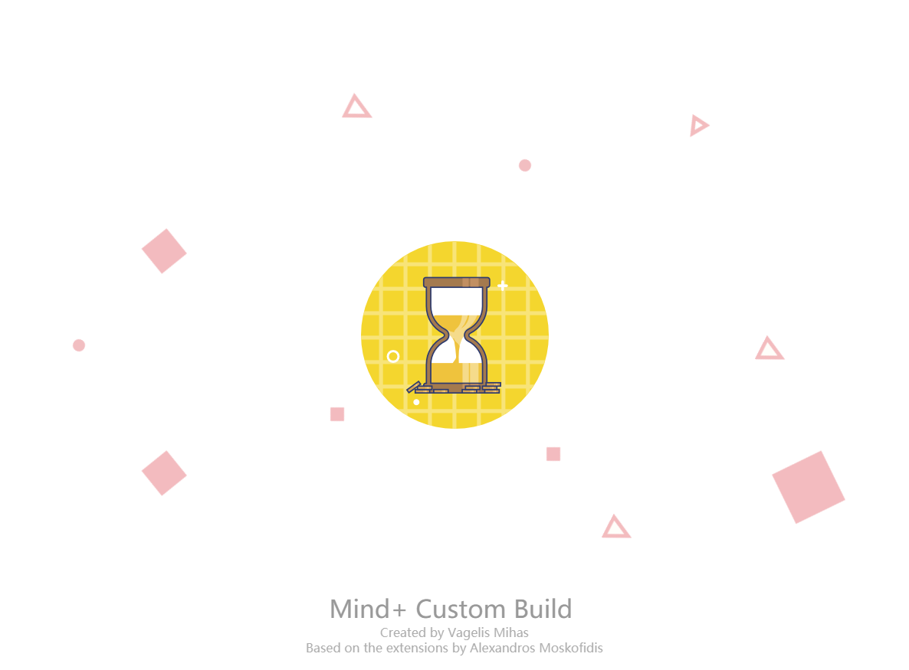
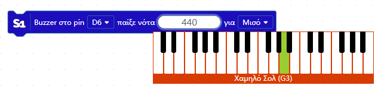
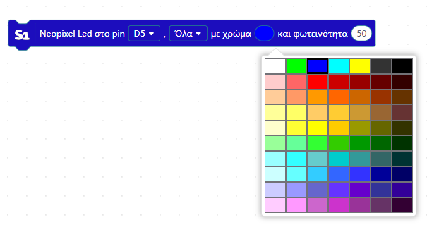
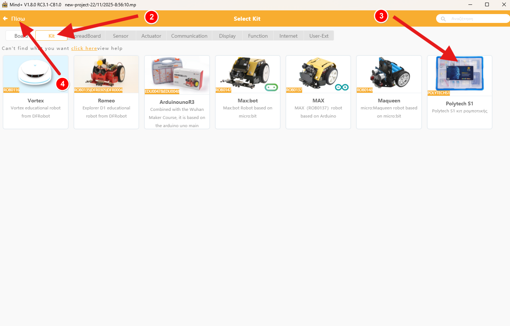

# Mind+ Custom Build

Το **Mind+ Custom Build** είναι μια τροποποιημένη έκδοση του Mind+,  
η οποία υποστηρίζει εγγενώς το κιτ ρομποτικής **Polytech S1** τόσο σε **ONLINE** όσο και σε **OFFLINE** mode.

Χρησιμοποιήθηκε το πρόσθετο του **Αλέξανδρου Μοσκοφίδη**, το οποίο εμπλουτίστηκε με νέες δυνατότητες, UI εργαλεία και επιπλέον λειτουργίες.

> ✔️ Υπό ανάπτυξη: πλήρης υποστήριξη για το κιτ Polytech R2

---

## 🚀 ONLINE & OFFLINE mode

Υποστηρίζονται όλοι οι αισθητήρες/ενεργοποιητές του κιτ.
Επιπλέον υποστηρίζεται και ο πομπός και ο δέκτης υπερύθρων.  
Μπορείτε να χρησιμοποιήσετε το τηλεκοντρόλ που υπάρχει στο R3 κιτ.

---

## 🧩 Βελτιώσεις

Γίνεται χρήση όμορφων UI widgets όπως:

> 🎹 **Πιανάκι** για τις νότες στο buzzer  
> 🕹️ **Γραφικό τηλεχειριστήριο** για τα blocks υπερύθρων (customized ειδικά για το Polytech kit)  
> 🎨 **Παλέτα χρώματος** για την επιλογή χρώματος των RGB Neopixel

  
  

  

---

### 💡 Hardware & Blocks

- Για τα **Neopixel** χρησιμοποιείται η ενσωματωμένη βιβλιοθήκη της DF_Robot  
- Ο κινητήρας μπορεί πλέον να συνδεθεί και στο **SPI port**  
- Τα blocks είναι οργανωμένα σε κατηγορίες για εύκολη εύρεση  

---

### 🛠️ System Improvements

- Απενεργοποιήθηκε ο έλεγχος ενημερώσεων και το αντίστοιχο popup window  
- Σε νέα εγκατάσταση η προεπιλεγμένη γλώσσα είναι τα **Ελληνικά**  
- Διάφορες άλλες μικροβελτιώσεις σε blocks & λειτουργίες

---

## 📥 Installation

Υλοποιήθηκαν δύο installers:

### ⭐ Mind+ Custom Build Full Installer  
Περιέχει το official Mind+ bundle που απαιτείται και όλα τα patches.

### ⭐ Mind+ Custom Build Update Installer  
Περιέχει μόνο updates / προσθήκες των πρόσθετων (μικρό μέγεθος, γρήγορη εγκατάσταση).

> 🟢 Σε πρώτη εγκατάσταση: χρησιμοποιήστε το **Full Installer**  
> 🔁 Σε επόμενες ενημερώσεις: χρησιμοποιήστε το **Update Installer**

---

## 🧩 Προσθήκη επέκτασης (Polytech Extension)

Για να προσθέσετε την επέκταση (online & offline) ακολουθήστε τις παρακάτω οδηγίες:

---

## ✍️ Author

**Βαγγέλης Μίχας**  
Mind+ Custom Build & Extensions Development

---

## 📝 Credits

- Πρωτότυπο extension: **Αλέξανδρος Μοσκοφίδης**  
- Mind+ Platform: **DFRobot**  

---

## ⚖️ License

> **GPLv3**.

---

## ⭐ Support

Για προτάσεις, bugs και νέα χαρακτηριστικά:  
➡️ Άνοιξε issue στη σελίδα του GitHub repository

---

## 📦 Latest Releases

Κατεβάστε τα installers από την ενότητα **Releases** του GitHub.

