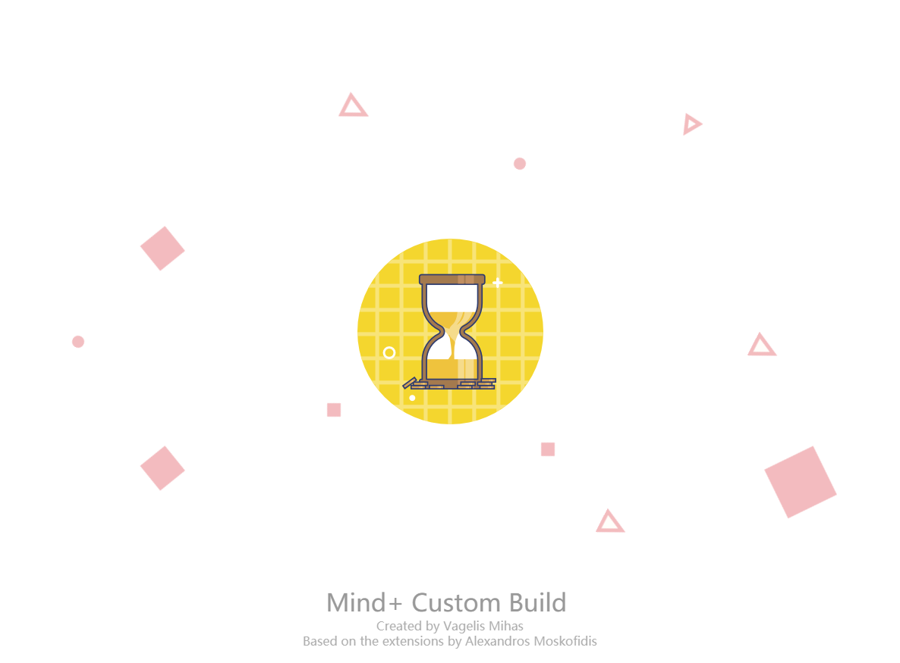
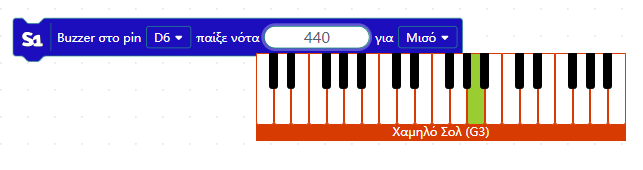
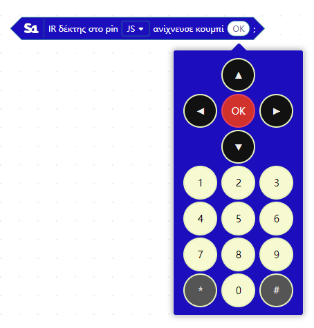
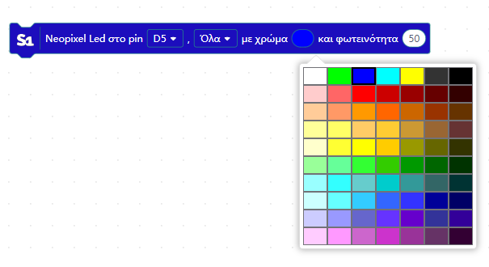
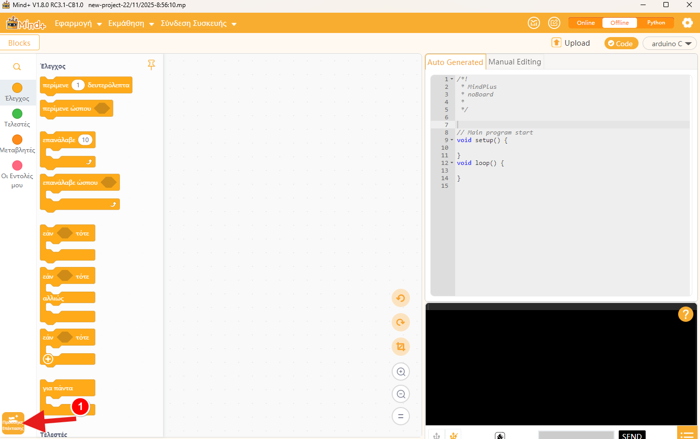
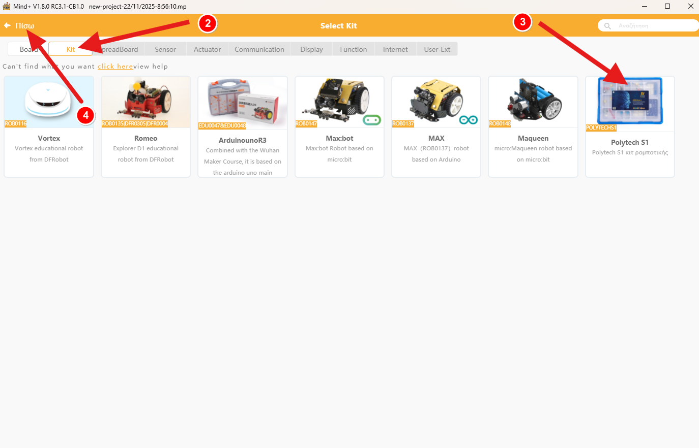

# Mind+ Custom Build

Το **Mind+ Custom Build** είναι μια τροποποιημένη έκδοση του Mind+,  
η οποία υποστηρίζει εγγενώς τα κιτ ρομποτικής **Polytech S1** και **Polytech R2** τόσο σε **ONLINE** όσο και σε **OFFLINE** mode.

Χρησιμοποιήθηκε το πρόσθετο του **Αλέξανδρου Μοσκοφίδη**, το οποίο εμπλουτίστηκε με νέες δυνατότητες, UI εργαλεία και επιπλέον λειτουργίες.

> ✅ **Νέο**: Πλήρης υποστήριξη για το κιτ **Polytech R2** με νέα blocks!  
> ⚡ **Νέο**: Υλοποίηση **Custom Firmata Firmware** με ειδικά σχεδιασμένες λειτουργίες για τα κιτ **S1** και **R2**  

> ## 🤖 Δείτε επίσης: R2 Mission Control
> Νέα εφαρμογή **Android** για έλεγχο του εκπαιδευτικού ρομπότ **R2** μέσω Bluetooth — 👉 **[Δείτε εδώ](https://github.com/vmihas/R2-Mission-Control)** 📱

---

## 🚀 ONLINE & OFFLINE mode

### Polytech S1 Kit
Υποστηρίζονται όλοι οι αισθητήρες/ενεργοποιητές του κιτ.
Επιπλέον υποστηρίζεται και ο πομπός και ο δέκτης υπερύθρων.  
Μπορείτε να χρησιμοποιήσετε το τηλεκοντρόλ που υπάρχει στο R3 κιτ.

### Polytech R2 Kit (🆕Νέο στο v2.0!)
Πλήρης υποστήριξη για το R2 robot car όπως:
- **Έλεγχος κίνησης**: blocks για κίνηση μπροστά/πίσω, στροφή δεξιά/αριστερά, έλεγχος διάρκειας κίνησης
- **Ακολούθηση γραμμής**: αυτόνομη ακολούθηση μαύρης γραμμής με 3 αισθητήρες (line patrol)
- **Αισθητήρες**: υπερηχητικός αισθητήρας απόστασης, φωτοαντίσταση, μικρόφωνο
- **RGB Neopixel LEDs**: πλήρης έλεγχος 4 RGB LEDs με rainbow effects
- **Buzzer με μελωδίες**: προεγκατεστημένες μελωδίες και ελεύθερος προγραμματισμός νοτών
- **Servo έλεγχος**: για πρόσθετα servomotors

---

## 🧩 Βελτιώσεις

Γίνεται χρήση όμορφων UI widgets όπως:

> 🎹 **Πιανάκι** για τις νότες στο buzzer  
> 🕹️ **Γραφικό τηλεχειριστήριο** για τα blocks υπερύθρων (customized ειδικά για το Polytech kit)  
> 🎨 **Παλέτα χρώματος** για την επιλογή χρώματος των RGB Neopixel

  
  

  

---

### 💡 Hardware & Blocks

- Ενιαίο περιβάλλον χρήσης και εύκολη εναλλαγή από **ONLINE ↔ OFFLINE** με ένα κουμπί  
- Τα blocks είναι οργανωμένα σε κατηγορίες για εύκολη εύρεση  
- Για την υποστήριξη του hardware χρησιμοποιούνται οι ενσωματωμένες βιβλιοθήκες της **DFRobot**  
- **Custom Firmata Firmware**: με πλήρη υποστήριξη NeoPixel RGB LEDs σε ONLINE mode και ειδικά σχεδιασμένες λειτουργίες για τα κιτ **S1** και **R2**  
- **Προηγμένες λειτουργίες**: Rainbow effects, Line Patrol, Motor control

---

### 🛠️ System Improvements

- 🔌 **Auto-connect**: νέο checkbox στο μενού επιλογής σειριακής θύρας για αυτόματη σύνδεση με την πρώτη διαθέσιμη συσκευή  
- Απενεργοποιήθηκε ο έλεγχος ενημερώσεων και το αντίστοιχο popup window  
- Σε νέα εγκατάσταση η προεπιλεγμένη γλώσσα είναι τα **Ελληνικά**  
- Διάφορες άλλες μικροβελτιώσεις σε blocks & λειτουργίες

---

## 📥 Installation

Υλοποιήθηκαν δύο installers:

### ⭐ Mind+ Custom Build Full Installer  
Περιέχει το official Mind+ bundle που απαιτείται και όλα τα patches.

### ⭐ Mind+ Custom Build Update Installer  
Περιέχει μόνο updates / προσθήκες των πρόσθετων (μικρό μέγεθος, γρήγορη εγκατάσταση).

> 🟢 Σε πρώτη εγκατάσταση: χρησιμοποιήστε το **Full Installer**  
> 🔁 Σε επόμενες ενημερώσεις: χρησιμοποιήστε το **Update Installer**

---

## 🧩 Προσθήκη επέκτασης

Για να προσθέσετε την επέκταση (online & offline) ακολουθήστε τις παρακάτω οδηγίες:

## 📁 Έτοιμα έργα Mind+

### Polytech S1
Μπορείτε να κατεβάσετε ένα **έτοιμο έργο Mind+** το οποίο περιέχει ήδη ενεργοποιημένη την επέκταση **S1** τόσο σε **ONLINE** όσο και σε **OFFLINE** mode από 🔗 **[εδώ](https://raw.githubusercontent.com/vmihas/mindplus-custom-build/main/S1.mp)**.  

### Polytech R2 (🆕Νέο!)
Έτοιμο έργο για το κιτ **R2** με ενεργοποιημένα όλα τα blocks διαθέσιμο από 🔗 **[εδώ](https://raw.githubusercontent.com/vmihas/mindplus-custom-build/main/examples/R2.mp)**.

Έτσι δεν θα χρειάζεται να ακολουθήσετε τα βήματα χειροκίνητης προσθήκης της επέκτασης.

Επίσης, **ενδεικτικά παραδείγματα** χρήσης και λειτουργίας των blocks μπορείτε να δείτε:
- 📘 S1 Examples: **[εδώ](https://github.com/vmihas/MindPlus-Custom-Build/blob/main/S1-EXAMPLES.md)**
- 📘 R2 Examples: **[εδώ](https://github.com/vmihas/MindPlus-Custom-Build/blob/main/R2-EXAMPLES.md)** (Νέο!)

Κατεβάστε τα 📥 από **[εδώ](https://github.com/vmihas/mindplus-custom-build/tree/main/examples)** (φάκελος `examples` του repository).  
Για να κατεβάσετε ένα αρχείο, κάντε κλικ στο αρχείο και μετά πατήστε το εικονίδιο 
.

---

## ✍️ Author

**Βαγγέλης Μίχας**  
Mind+ Custom Build & Extensions Development  
📧 [vmihas@sch.gr](mailto:vmihas@sch.gr)

---

## 📝 Credits

- Πρωτότυπο extension: **Αλέξανδρος Μοσκοφίδης**  
- Mind+ Platform: **DFRobot**  

---

## ⚖️ License

> **GPLv3**.

---

## ⭐ Support

Για προτάσεις, bugs και νέα χαρακτηριστικά:  
➡️ Άνοιξε issue στη σελίδα του GitHub repository, ή στείλε email στο [vmihas@sch.gr](mailto:vmihas@sch.gr)

---

## 📦 Latest Releases

Κατεβάστε τα installers από την ενότητα **Releases** του GitHub.

