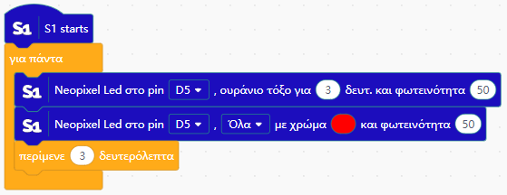
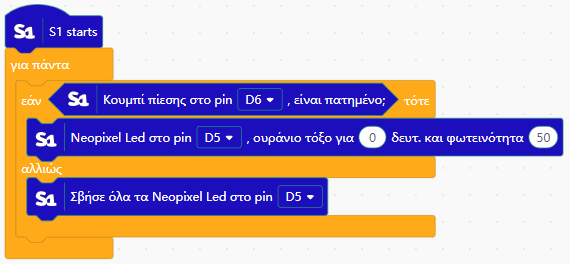
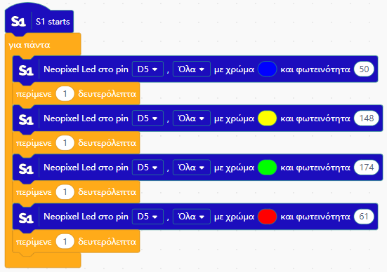
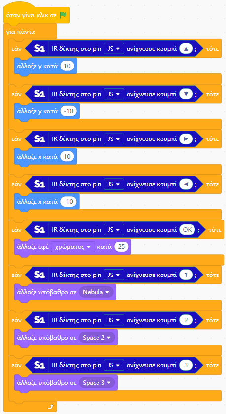

# 📘 Παραδείγματα Χρήσης (Examples)

Σε αυτό το αρχείο θα βρείτε παραδείγματα χρήσης και λειτουργίας των blocks του πρόσθετου S1.

---

## 🌈 Neopixel – Rainbow Effect

### 🔹 Blocking λειτουργία

Το πρόγραμμα περιμένει να ολοκληρωθεί το rainbow effect πριν συνεχίσει.

### 🔹 Non-blocking λειτουργία

Το rainbow effect εκτελείται κανονικά χωρίς να μπλοκάρει το υπόλοιπο πρόγραμμα (δεν χρησιμοποιείται `delay()`).

---

## 🌈 Neopixel – Ορισμός χρώματος από παλέτα

Παράδειγμα χρήσης του block **Neopixel Led … με χρώμα και φωτεινότητα**.

📁 Kατεβάστε το έργο από [εδώ](https://raw.githubusercontent.com/vmihas/MindPlus-Custom-Build/main/examples/neopixel-palette.mp)

---

## 📡 IR Remote – Ανίχνευση κουμπιών (online mode)

Παράδειγμα χρήσης του block **IR δέκτης … ανίχνευσε κουμπί** με πολλαπλά πλήκτρα του τηλεχειριστηρίου σε online mode.

📁 Kατεβάστε το έργο από [εδώ](https://raw.githubusercontent.com/vmihas/MindPlus-Custom-Build/main/examples/ir-online-demo.mp)

---
